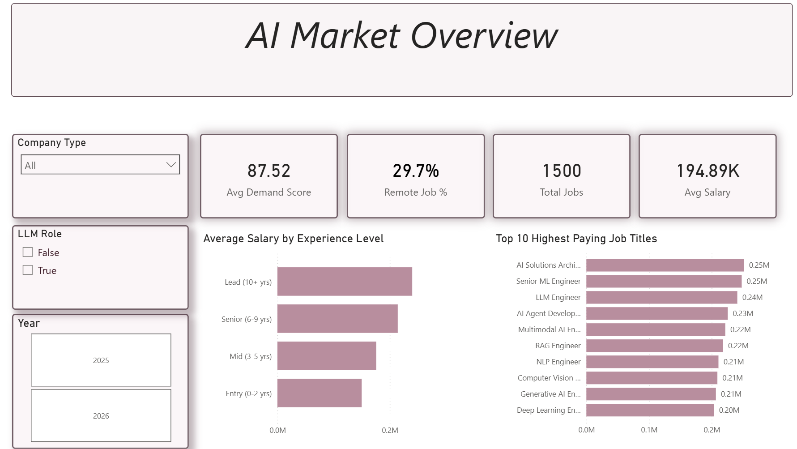
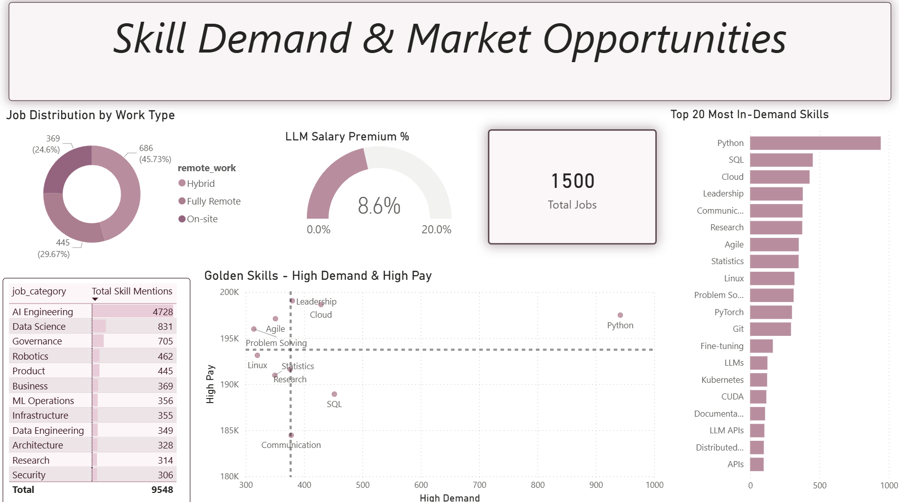
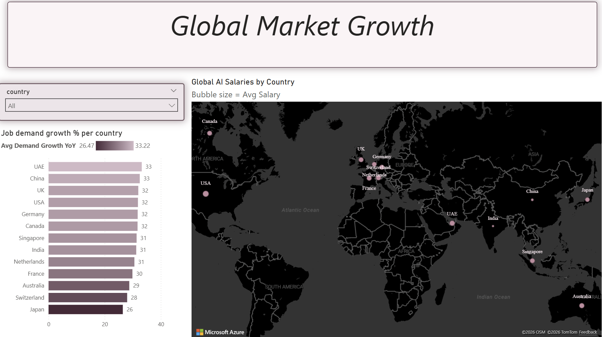

AI Global Job Market Insights & Trends (2025-2026)

* Comprehensive Power BI dashboard & interactive analysis of the global AI job market, focusing on salary benchmarks, regional growth, and work-type dynamics.

--

Project Overview
This project provides a comprehensive analysis of the global AI job market. By leveraging data visualization, the dashboard explores how the demand for artificial intelligence skills is shaping salaries and work dynamics across different industries and regions.

--

Dataset Information

The analysis is based on a comprehensive dataset of global AI job market trends (2025-2026). 
**Data Source:** Kaggle , [Kaggle - AI Jobs Market 2025-2026](https://www.kaggle.com/datasets/alitaqishah/ai-jobs-market-2025-2026-salaries)
**Size:** Over 1,500+ job records with detailed features.
**Key Attributes:** Job Title, Company Type, Experience Level, Salary (USD), Remote Ratio, and Required Skills.

What this Dashboard Answers:
**Market Demand:** Which AI-related roles are currently the most sought after?
**Salary Benchmarks:** How do experience levels and specific technical skills impact earning potential?
**Work-Life Dynamics:** What is the distribution of Remote vs. On-site opportunities in the tech sector?
**Global Growth:** Which countries are leading the surge in AI job availability?

--

Dashboard Preview

---

Detailed Visual Analysis

1. AI Market Overview (Executive Summary)
**KPI Tiles:** Provides a high-level snapshot of the market with a **Demand Score of 87.52** and an average salary of **$194.89K**, indicating a highly competitive and lucrative field.
**Salary by Experience:** Shows a clear upward trajectory in compensation, with **Lead roles** significantly outperforming Entry and Mid-level positions, emphasizing the value of seniority in AI.
**Top Paying Job Titles:** Highlights that **AI Solutions Architects** and **Senior ML Engineers** are currently at the top of the pay scale, often exceeding $0.25M.

2. Skill Demand & Market Opportunities
**The "Golden Skills" Matrix:** A scatter plot identifying high-demand/high-pay skills. **Python** stands out as the ultimate "Golden Skill" with the highest demand, while **Cloud** and **Leadership** skills command premium salaries.
**LLM Salary Premium:** A specialized gauge chart showing that expertise in **Large Language Models (LLMs)** grants an average **8.6% salary premium**, proving the direct financial impact of staying updated with Generative AI.
**Work Type Distribution:** Reveals that nearly **30%** of AI roles are fully remote, reflecting the modern tech industry's shift towards flexible work environments.

3. Global Market Growth
**Regional Demand YoY:** A ranking of countries by year-over-year growth. The **UAE and China** lead the surge with **33% growth**, showcasing emerging hubs for AI talent outside the traditional US market.
**Global Salary Mapping:** A geospatial visualization where bubble size represents average salary. It clearly identifies North America and parts of Europe as high-compensation zones, while Asia and the Middle East are rapidly closing the gap in demand.

Tools Used
* **Power BI** (Data Visualization & UI/X Design)
* **DAX** (Custom Metrics & Calculations)
* **Power Query** (Data Cleaning & Transformation)

Project Files
* **[Download Power BI File (.pbix)](aiJobsProject.pbix)** - Access the full interactive dashboard and data model.
